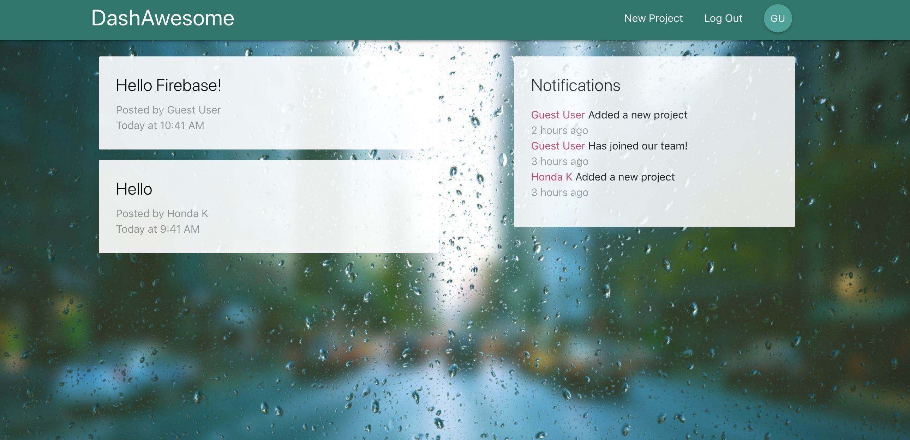

# DashAwesome



## Introduction

Simple project dashboard tool with authentication and cloud functions.

## Tools

- Create-react-app cli
- Redux-thunk
- Materializecss
- React Router v5
- Moment
- Firebase
- Colud Firestore

## Start App

Clone repo, install, cd into folder and run:

```
npm install
npm start
```
